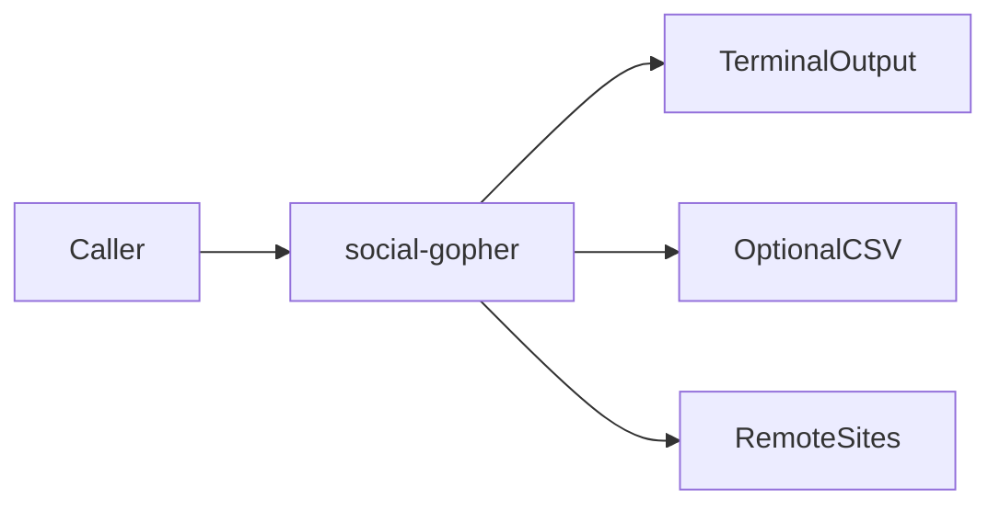
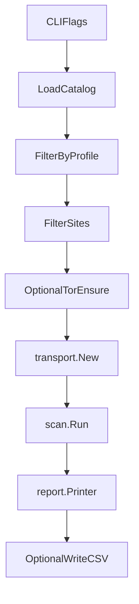
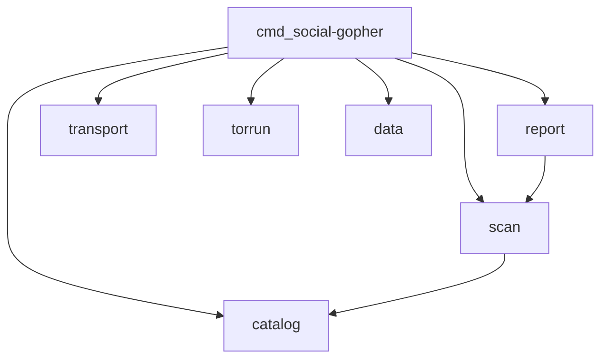

# Social Gopher architecture

This document gives the high-level system architecture of the social-gopher
CLI.

## Purpose and scope

Social Gopher checks whether a **username** exists on many social networks and
websites. It loads a curated **site catalog**, probes sites concurrently over
HTTP, classifies each probe, and prints matches with profile URLs. Optional CSV
export and Tor/proxy routing are available.

This file covers:

- The package map and dependency direction
- The scan data flow from CLI flags to report/CSV
- Catalog trust boundary and profile filtering
- Probe classification at a high level
- Transport modes and Tor lifecycle
- Exit codes and invariants agents must not break

This file does **not** cover:

- Full usage examples and flag tables — see [README.md](../../README.md)
- Catalog edit procedure — see [add-catalog-site](../skills/add-catalog-site/SKILL.md)
- Classification matrix details — see [probe-classifier](../skills/probe-classifier/SKILL.md)
- Agent index — see [AGENTS.md](../../AGENTS.md)

## System context

The caller runs the `social-gopher` binary with a username (or
`-validate-catalog`). The binary loads the embedded or custom catalog, filters
sites, probes them, and writes terminal output and optionally a CSV file.

The module is Go 1.22+ (`go.mod` pins the toolchain). Runtime dependencies are
the Go standard library plus `golang.org/x/net` for SOCKS dialers. There is no
server or long-running daemon beyond an optional short-lived Tor child process.



## High-level scan pipeline

[`cmd/social-gopher/main.go`](../../cmd/social-gopher/main.go) runs these steps:

1. Parse flags and validate usage (username vs `-validate-catalog`).
2. Load the catalog (`data.SitesJSON` or `-catalog` path) via `catalog.Load` /
   `LoadFile`.
3. Apply `catalog.FilterByProfile`, then `catalog.Filter` (`-site`, `-nsfw`).
4. Install a signal context (SIGINT / SIGTERM).
5. If `-tor` and no `-proxy`, call `torrun.Ensure` and set the SOCKS proxy URL.
6. Build an `http.Client` with `transport.New`.
7. Either run validate-catalog self-tests, or:
   - Construct `scan.Scanner` and `report.Printer`
   - Range over `scanner.Run` results and print them
   - Optionally write CSV for found rows
8. Map interrupt to exit codes.



## Package map

| Package | Role |
| ------- | ---- |
| `cmd/social-gopher` | CLI composition root: flags, wiring, exit codes |
| `data` | Embeds `sites.json` at build time |
| `internal/catalog` | Load, validate, and filter the site catalog |
| `internal/scan` | Concurrent probes and existence classifiers |
| `internal/report` | TTY printer and CSV export |
| `internal/transport` | HTTP client, proxy dial options |
| `internal/torrun` | Optional system Tor process lifecycle |

Do not put business logic in `cmd`. Do not introduce new top-level packages
without a clear boundary.



## Catalog and trust boundary

The default catalog is embedded from [`data/sites.json`](../../data/sites.json)
via [`data/embed.go`](../../data/embed.go). Rebuild the binary after catalog
edits so the embed refreshes.

`catalog.Load` uses `json.Decoder` with `DisallowUnknownFields`. Each site needs
`name`, `home_url`, `profile_url` (with `{username}`), `check`, and `profile`
(`default` | `developer` | `creative` | `community`). Optional fields include
`probe_url`, `method`, `headers`, `username_pattern`, self-test usernames, and
`nsfw`.

| `check.type` | Role |
| ------------ | ---- |
| `status` | First-response status (default not-found `[404]`); optional soft-404 text |
| `body` | First-response body must include `not_found_text` when missing |
| `redirect` | Exists on 2xx; otherwise missing (redirects are not followed) |

`-profile` is **non-cumulative**: the effective set is sites whose `profile` is
in `{default} ∪ requested profiles`. `full` selects the entire catalog. Profiles
apply before `-site` / `-nsfw`.

Custom `-catalog` files are a **trust boundary**. Load rejects non-`http`/`https`
URLs, private/link-local/metadata hosts, `POST`, dangerous hop-by-hop/`Host`
headers, and invalid or over-long `username_pattern` values. DNS rebinding
remains a residual risk if a hostname later resolves to a private address.

See [`.agents/rules/catalog-schema.mdc`](../rules/catalog-schema.mdc) and
[add-catalog-site](../skills/add-catalog-site/SKILL.md).

## Probe classification

[`internal/scan`](../../internal/scan/scan.go) owns concurrent workers and
per-site `Check`. Probes never follow redirects
(`http.ErrUseLastResponse` on a client clone).

Existence outcomes:

| Value | Meaning |
| ----- | ------- |
| `found` | Username appears present |
| `not_found` | Username appears absent |
| `invalid` | Username fails `username_pattern` before HTTP |
| `unknown` | Ambiguous HTTP outcome (status/body paths) |
| `error` | Transport, body-read, or other probe failure |

High-level rules:

- **status** — not found if status is in `not_found_status` or soft-404 text
  matches; found on remaining 2xx; otherwise unknown.
- **body** — not found if any `not_found_text` matches; found on remaining 2xx;
  otherwise unknown.
- **redirect** — found on 2xx; otherwise not found.

Soft-404 text on a status check forces GET and a body read. Pure status checks
without soft-404 text prefer HEAD and may retry GET on HEAD failure. Body
checks require a successful body read.

For the full matrix and edit rules, see
[probe-classifier](../skills/probe-classifier/SKILL.md).

## Transport and Tor

[`internal/transport`](../../internal/transport/transport.go) builds the shared
`http.Client`:

- **Direct** — no proxy; environment `HTTP_PROXY` / `HTTPS_PROXY` / `ALL_PROXY`
  are **not** applied.
- **`-proxy`** — `socks5` / `socks5h` (remote DNS for both) or `http` / `https`.
- **`-tor`** — if `-proxy` is also set, `-proxy` wins and a notice is printed;
  otherwise `torrun.Ensure` reuses or starts Tor on `127.0.0.1:9050` and the
  client uses `socks5h://127.0.0.1:9050`.

[`internal/torrun`](../../internal/torrun/torrun.go) probes the SOCKS port, reuses
an existing SOCKS listener, errors on a non-SOCKS listener, or spawns system
`tor` with a temp data directory and stops it on `Close`.

## Output

[`internal/report`](../../internal/report/report.go) drives the TTY UX when
stdout is a terminal: a short-lived spinner while checking, green `[+]` lines
for found profiles, and a summary (`Found x/y profiles in …`). Non-hits print
only with `-v` / `-verbose`.

`-csv` writes found rows only to a sanitized `{username}.csv` in the current
directory (path separators and NUL replaced). Cells that look like spreadsheet
formulas are prefixed with `'`.

## Validate-catalog mode

`-validate-catalog` takes no username. For each filtered site with both
`username_claimed` and `username_unclaimed`, it expects claimed → `found` and
unclaimed → `not_found`. Sites missing fixtures are `SKIP`. Any `FAIL` yields
exit code `1`. Workers are forced to `1` for this path.

Prefer scoped `-site` validation locally; avoid unbounded full-catalog live
runs unless explicitly requested.

## Errors and contracts

| Exit code | When |
| --------- | ---- |
| `0` | Success (scan or validate with no failures) |
| `2` | Usage / flag errors (including bad profile, empty username, workers ≤ 0) |
| `1` | Load, filter, transport, Tor, scanner, CSV, or validate failures |
| `130` | Interrupted via cancel (`Ctrl+C` / SIGTERM) after a partial run |

Invariants agents must not break without an explicit product decision:

- Do not follow redirects in probes.
- Do not treat status/body first-response 3xx as found.
- Do not re-enable environment proxies in direct mode.
- Do not weaken catalog URL/header/method validation.
- Keep business logic out of `cmd/social-gopher`.

## Verification and agent layout

Local verify commands (CI parity):

```bash
golangci-lint fmt ./...
golangci-lint run ./...
go test ./... -race -count=1
```

After catalog or scan changes, rebuild
(`go build -o social-gopher ./cmd/social-gopher`) and prefer scoped
`-validate-catalog -site '<Name>'`. See
[local-verify](../skills/local-verify/SKILL.md).

CI workflows under [`.github/workflows/`](../../.github/workflows/):

- `test.yml` — build, `go test ./... -race`, govulncheck
- `golangci-lint.yml` — format diff and lint
- `validate-catalog.yml` — scheduled/dispatch full catalog self-tests

Agent support lives under `.agents/`:

- `rules/` — project, catalog, and security policy
- `skills/` — catalog, verify, classifier, and Go design skills
- `commands/` — `/verify`, `/add-site`, `/validate-site`
- `hooks/` — gofmt after edit; guard broad live scans
- `docs/` — this architecture file

See [AGENTS.md](../../AGENTS.md) for the full index.
